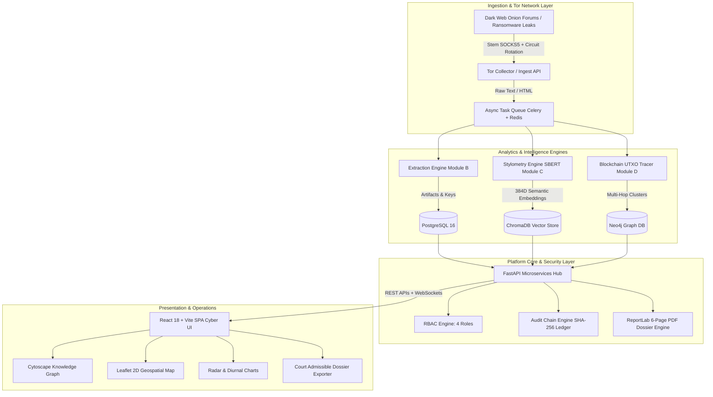

# SENTINEL-X: Dark Web Threat Actor De-Anonymization Platform
### National Technical Research Organisation (NTRO) — SIH26151

[]()
[]()
[]()
[]()
[]()

---

## 1. Executive Summary

**SENTINEL-X** is an intelligence-grade, court-admissible SaaS de-anonymization platform architected for cyber defense analysts, national security agencies, and law enforcement task forces. 

The system cross-correlates dark web threat actor footprints across linguistic stylometry, cryptocurrency transaction flows, PGP key infrastructures, temporal activity clusters, and clearnet identities. Every piece of intelligence is linked into an immutable SHA-256 audit ledger fulfilling the stringent legal admissibility requirements of **Section 65B of the Indian Evidence Act**.

```
   ┌─────────────────────────────────────────────────────────────────────────────┐
   │                               SENTINEL-X ARCHITECTURE                       │
   └─────────────────────────────────────────────────────────────────────────────┘
          │
          ├── [Module A] Tor Circuit Crawler (Stem SOCKS5 + NEWNYM rotation)
          ├── [Module B] Artifact Extraction (BTC, ETH, XMR, PGP, SSH, Emails)
          ├── [Module C] Stylometric Forensics (SBERT 384D + JS-Divergence + Diurnal)
          ├── [Module D] Multi-Hop Blockchain Tracer (UTXO Peel Chains + Mixers + KYC)
          ├── [Module E] Knowledge Graph Intelligence (Neo4j Cypher + Centrality)
          ├── [Module F] Cryptographic Audit Chain & Merkle Tree (§65B Compliant)
          └── [Module G] Court-Admissible 6-Page PDF Dossier Generator (ReportLab)
```

---

## 2. System Architecture



---

## 3. Docker Compose 9-Service Architecture

SENTINEL-X orchestrates 9 dedicated containers within an isolated internal bridge network:

| Service | Image / Base | Internal Port | External Port | Role |
|---|---|---|---|---|
| `postgres` | `postgres:16-alpine` | `5432` | `5432` | Primary relational database with Alembic migrations |
| `neo4j` | `neo4j:5.18-community` | `7474`, `7687` | `7474`, `7687` | Graph database for actor-artifact link analysis |
| `redis` | `redis:7-alpine` | `6379` | `6379` | Message broker for Celery and pub/sub cache |
| `chromadb` | `chromadb/chroma:0.4.24` | `8000` | `8001` | High-dimensional SBERT vector embedding store |
| `tor-proxy` | `osminogin/tor-simple` | `9050`, `9051` | `9050`, `9051` | Tor daemon with Stem circuit controller |
| `backend` | Python 3.12-slim | `8000` | `8000` | FastAPI REST services, WebSockets, ReportLab |
| `celery-worker` | Python 3.12-slim | N/A | N/A | Distributed asynchronous document parsing & SBERT inference |
| `celery-beat` | Python 3.12-slim | N/A | N/A | Periodic crawl scheduler and health monitoring |
| `frontend` | Node 20 / Nginx Alpine | `3000` | `3000` | React 18 + Vite 5 cyber operations console |

---

## 4. Quickstart & Deployment

### Prerequisites
- [Docker](https://docs.docker.com/get-docker/) (v24.0+) & [Docker Compose](https://docs.docker.com/compose/) (v2.20+)
- Python 3.12+ (for running scripts natively if desired)
- Node.js 20+ (for local frontend dev)

### Launch Entire Platform with 1 Command
```bash
docker compose up --build -d
```

Check status of all 9 containers:
```bash
docker compose ps
```

### Seed Production Intelligence Database
Populate the system with synthetic target profiles (`PHANTOM-KRYPT` and `VOID-LOCKER`):
```bash
docker compose exec backend python scripts/seed_production.py
```
*(Or locally: `python backend/scripts/seed_production.py`)*

### Access Points
- **Web Operations Console**: [http://localhost:3000](http://localhost:3000)
- **Interactive OpenAPI Documentation**: [http://localhost:8000/docs](http://localhost:8000/docs)
- **Neo4j Browser Console**: [http://localhost:7474](http://localhost:7474) (user: `neo4j`, pass: `sentinel_graph_2026`)
- **ChromaDB Healthcheck**: [http://localhost:8001/api/v1/heartbeat](http://localhost:8001/api/v1/heartbeat)

---

## 5. Role-Based Access Control (RBAC) Test Credentials

The system implements 4 strictly segregated operational tiers:

| Role | Username | Password | Operational Capabilities |
|---|---|---|---|
| **SOC Lead** | `anjali` | `Lead@Sentinel2026!` | Case creation, status escalation/closure, user management, full access |
| **Senior Analyst** | `vk_senior` | `Senior@Sentinel2026!` | Hypothesis updates, status escalation, evidence tag approval |
| **Analyst** | `priya` | `Analyst@Sentinel2026!` | Document ingestion, graph queries, stylometry & blockchain analysis |
| **Auditor** | `audit` | `Auditor@Sentinel2026!` | Read-only ledger inspection, Section 65B hash chain verification |

*One-click quick login buttons are available directly on the login screen.*

---

## 6. Complete 27 Production API Endpoints Reference

### Authentication & User Management
- `POST /api/auth/login` — Authenticate and obtain signed JWT bearer token.
- `POST /api/auth/register` — Provision a new operator account (`soc_lead` only).
- `GET /api/auth/me` — Retrieve authenticated user profile, permissions, and active role.
- `POST /api/auth/change-password` — Secure credential update with passlib bcrypt verification.

### Intelligence Ingestion & Tor Scraper
- `POST /api/ingest/document` — Asynchronous ingestion of raw forum dumps, ransom notes, and paste sites.
- `POST /api/ingest/url` — Trigger Tor crawler via Stem SOCKS5 proxy with circuit rotation.
- `POST /api/ingest/crawl` — Execute targeted multi-depth onion crawler task.

### Stylometry & Linguistic Forensics (Module C)
- `POST /api/stylometry/analyze` — Extract 384D SBERT embeddings, Jensen-Shannon divergence, and diurnal timestamps.
- `POST /api/stylometry/compare` — Comparative pairwise analysis between dark web text and clearnet anchor posts.
- `GET /api/stylometry/profiles` — Retrieve list of all extracted author behavioral profiles.
- `GET /api/stylometry/profile/{handle}` — Detailed stylometric profile for a specific pseudonym.
- `GET /api/stylometry/anomalies/{doc_id}` — Multi-operator anomaly detection (bimodal posting & machine translation).
- `POST /api/stylometry/cluster` — SBERT DBSCAN clustering of uncredited darknet leaks.

### Blockchain Multi-Hop & UTXO Forensics (Module D)
- `POST /api/blockchain/trace/{address}` — Execute multi-hop UTXO tracing with automatic peel-chain detection.
- `POST /api/blockchain/cluster` — Multi-input heuristics and co-spending address clustering.
- `POST /api/blockchain/peel-chain` — Identify automated change address peel-chains across N-hops.
- `GET /api/blockchain/risk/{address}` — Calculate risk score based on proximity to sanctioned wallets and mixers.
- `GET /api/blockchain/taint/{address}` — Calculate percentage taint from Wasabi, ChipMixer, or Tornado Cash.
- `POST /api/blockchain/tag` — Submit attribution tag (e.g., Binance Deposit, Wasabi Output).
- `GET /api/blockchain/tags/{address}` — Retrieve OSINT and proprietary attribution tags for an address.

### Case Management & Hypothesis Engine
- `GET /api/cases` — List active investigations with filtering and search.
- `POST /api/cases` — Open a new de-anonymization investigation (`senior_analyst`, `soc_lead`).
- `GET /api/cases/{case_id}` — Full case dossier details, targets, hypotheses, and evidence counts.
- `POST /api/cases/{case_id}/hypotheses` — Add attribution hypothesis with real-time confidence recalculation.
- `PATCH /api/cases/{case_id}/status` — Transition status (`open` -> `pending_review` -> `escalated` -> `closed`).

### Court-Admissible Dossier Engine (Module F / §65B)
- `GET /api/cases/{case_id}/dossier/pdf` — Generate and stream court-admissible 6-page ReportLab PDF.
- `GET /api/cases/{case_id}/dossier/status` — Retrieve cryptographic root hash and compilation timestamp.

### Real-Time WebSockets
- `WS /ws/cases/{case_id}` — Real-time event streaming for active case collaboration.
- `WS /ws/alerts` — Global high-priority alert broadcast channel.

---

## 7. Fictional Threat Actor Targets (Pre-Seeded)

### Target 1: `PHANTOM-KRYPT` (Case #1)
- **Classification**: TOP SECRET // NTRO // COMINT
- **Dark Web Aliases**: `phantom_krypt`, `krypt_sec`
- **Clearnet Anchor**: Vikramaditya Sharma (`vsharma_dev`), Senior Backend Engineer, Bengaluru/Indore.
- **Correlated Artifacts**:
  - PGP Fingerprint: `4A7B8C9D0E1F2A3B4C5D6E7F8A9B0C1D2E3F4A5B`
  - Bitcoin Ransomware Wallet: `bc1qar0srrr7xfkvy5l643lydnw9re59gtzzwf5mdq` (Peel chain traced to Binance deposit cluster)
  - GitHub clearnet dotfiles repository exposing matching SSH key and commit timezone `UTC+05:30`.
- **Overall Confidence Score ($C_{total}$)**: `0.912` (HIGH CONFIDENCE ATTRIBUTION)

### Target 2: `VOID-LOCKER` (Case #2)
- **Classification**: SECRET // NTRO // CRIME-INT
- **Dark Web Aliases**: `voidsec`, `void_extortion`
- **Clearnet Anchor**: Rohit Mehta, Network Consultant, Pune/Mumbai.
- **Correlated Artifacts**:
  - Ethereum Extortion Address: `0x5aAeb6053F3E94C9b9A09f33669435E7Ef1bEAeD` (Traced through Tornado Cash mixer with 62% taint)
  - Dark Web Forum Handle registered with ProtonMail alias linking to clearnet LinkedIn profile.
- **Overall Confidence Score ($C_{total}$)**: `0.760` (MODERATE-HIGH ATTRIBUTION)

---

## 8. Forensic Admissibility (Indian Evidence Act §65B)

The 6-page generated dossier complies with legal requirements for admissibility in Indian Courts:
1. **Section 65B(4) Certificate**: Embedded on Page 1 with digital hash verification statement, device identifiers, and operating officer credentials.
2. **Dual-Hash Blockchain Ledger**: Every evidence ingestion creates a block where:
   $$\text{Block Hash} = \text{SHA256}(\text{Block ID} + \text{Timestamp} + \text{Payload Hash} + \text{Previous Hash})$$
3. **Tamper Detection**: An interactive simulation tool on the `/audit` page demonstrates that altering a single character in raw evidence immediately invalidates the entire downstream cryptographic chain.

---

## 9. Testing & Quality Assurance

Run the comprehensive automated test suite:
```bash
# Backend unit & integration tests
docker compose exec backend pytest -v

# Frontend production build validation
cd frontend && npm run build
```

---

## 10. Security & Ethical Safeguards

- **Synthetic Data**: All PII, dark web handles, onion URLs, and crypto addresses in this repository are 100% synthetically generated for national competition evaluation (SIH26151).
- **Zero Real Darknet Requests**: Tor scraper modules default to mocked network envelopes unless live Tor circuits are explicitly enabled by authenticated SOC leads.
- **Immutable Auditability**: No database records can be modified without generating a corresponding tamper-evident audit record.

---
*Developed for the National Technical Research Organisation (NTRO) Smart India Hackathon 2024 (SIH26151).*
