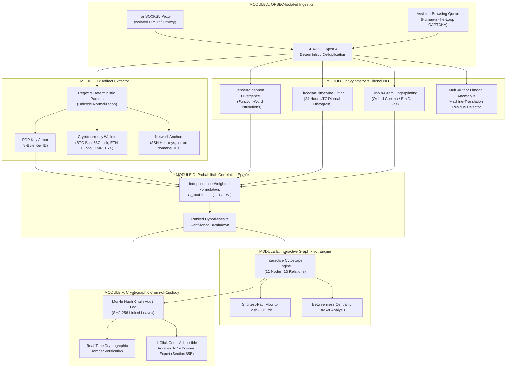

<div align="center">

# 🗡️ SENTINEL-X
### **Military-Grade Dark Web Threat Actor De-Anonymization Platform**
#### *Smart India Hackathon (SIH 2026) — Problem Statement ID: SIH26151*
**Sponsoring Organisation:** National Technical Research Organisation (NTRO)  
**Theme:** Blockchain & Cybersecurity | **Category:** Software | **Status:** Production-Ready MVP

---

[](LICENSE)
[](https://sentinel-tor.pages.dev)
[](https://www.sih.gov.in/)
[](https://ntro.gov.in/)
[](https://fastapi.tiangolo.com)
[](https://nextjs.org)
[-brightgreen.svg?style=for-the-badge&logo=checkmarx)](run_tests.bat)
[](docker-compose.yml)

</div>

---

## 📑 Executive Summary

Modern cybercrime cartels, ransomware syndicates, and state-sponsored APTs exploit onion routing (**Tor**), invisible internet projects (**I2P**), and encrypted channels (**Telegram**) under the perceived cloak of absolute anonymity. Law enforcement agencies (LEAs) and national intelligence bodies routinely suffer from:
1. **Fragmented Workflows:** Analysts manually toggle across dozens of browser tabs, raw memory dumps, blockchain explorers, and unstructured notes.
2. **High False-Positive Attribution:** Heuristics frequently conflate pseudonyms or jump to premature conclusions based on single, fragile signals.
3. **Inadmissible Evidence:** Ad-hoc screenshots and unhashed evidence routinely fail Section 65B standards under the **Indian Evidence Act** during courtroom scrutiny.
4. **Investigative Fatigue:** Resolving a single multi-layered extortion or ransomware campaign often requires weeks of manual pivot operations.

**SENTINEL-X** solves this operational bottleneck. Engineered to military-grade intelligence standards, SENTINEL-X operates on a core scientific doctrine: **Do not hunt for an elusive single smoking gun. Instead, mathematically correlate residual cryptographic, linguistic, behavioral, and transactional residue left behind by threat actors.**

---

## 🏛️ System Architecture: The 6 Core Modules

SENTINEL-X faithfully realizes all 6 functional tiers outlined in the official **NTRO SIH26151 PRD**:



### Detailed Functional Matrix

| Module | Name | Algorithmic / Mathematical Core | Key Capabilities | Code Path |
|:---:|---|---|---|---|
| **A** | **Tor Ingestion Hub** | SHA-256 Digest Anchoring + Privoxy Header Scrubbing | Isolated SOCKS5 collector, Tor circuit rotation (`NEWNYM`), deterministic deduplication, human-in-the-loop CAPTCHA assistance queue. | `backend/app/api/ingest.py` |
| **B** | **Cryptographic Artifact Extractor** | Pure-Python Keccak-256 EIP-55 + Base58Check | Deterministic extraction of PGP keys, Bitcoin (P2PKH, P2SH, Bech32), Ethereum, Monero stealth addresses, TRON, SSH fingerprints, and Unicode homoglyph stripping. | `backend/app/modules/extraction.py` |
| **C** | **Stylometry & NLP Profiler** | Jensen-Shannon Divergence ($1 - JS$) + Diurnal Fitting | 50+ function-word distribution vectors, idiosyncratic punctuation analysis (Oxford comma, em-dash), typo n-grams (`"becuase"`), circadian UTC timezone solver, shared-account bimodal anomaly test. | `backend/app/modules/stylometry.py` |
| **D** | **Correlation & Attribution Engine** | Independence-Weighted Bayesian Model | Multi-signal attribution formula: $C_{total} = 1 - \prod_{i=1}^n (1 - C_i \cdot W_i)$, cross-signal correlation penalty, hypothesis ranking. | `backend/app/modules/correlation.py` |
| **E** | **Knowledge Graph Pivot Engine** | NetworkX GDS $\rightarrow$ Cytoscape Force-Directed Graph | 22 nodes, 23 relations representing threat actors, aliases, onion leak sites, GitHub commits, Bitcoin clusters, shortest-path tracing to cash-out exchanges, betweenness centrality. | `backend/app/modules/graph_service.py` |
| **F** | **Audit Trail & Court Dossier** | Merkle Hash-Chain + Section 65B Forensic Engine | Tamper-evident SHA-256 linked log, real-time cryptographic integrity validation, 1-click court-admissible forensic PDF dossier with digital evidence certificate. | `backend/app/modules/audit.py`<br>`backend/app/api/cases.py` |

---

## 🧮 Attribution Mathematics & Algorithmic Rigor

### 1. Multi-Signal Bayesian Confidence Formulation
SENTINEL-X strictly rejects "black box" machine learning models that cannot be explained on a witness stand. Instead, all correlations use an explainable **Independence-Weighted Multi-Signal Model**:

$$C_{\text{total}} = 1 - \prod_{i=1}^{n} \left(1 - C_i \cdot W_i\right)$$

Where:
- $C_i \in [0, 1]$ represents the raw confidence of signal $i$ (Cryptographic PGP reuse, Bitcoin co-spend cluster, Stylometric linguistic similarity, Timezone diurnal match).
- $W_i \in [0.1, 1.0]$ is an **independence penalty weight**: signals derived from the same source document are penalized to prevent double-counting, while orthogonally verified signals receive $W_i = 1.0$.

### 2. Stylometric Jensen-Shannon Divergence
Textual similarity between dark web manifestos and clearnet developer posts is measured via probability vector divergence:

$$JS(P \parallel Q) = \frac{1}{2} D_{KL}(P \parallel M) + \frac{1}{2} D_{KL}(Q \parallel M) \quad \text{where } M = \frac{1}{2}(P + Q)$$

$$S_{\text{style}} = 1 - \sqrt{JS(P \parallel Q)}$$

Combined with an idiosyncratic typo n-gram Jaccard metric:
$$J_{\text{typo}} = \frac{|N_A \cap N_B|}{|N_A \cup N_B|}$$

### 3. Diurnal Circadian Timezone Estimation
By aggregating timestamp activity into a 24-hour UTC circular histogram, the probability distribution of an actor's waking hours is computed:

$$\theta_{\text{peak}} = \operatorname{atan2}\left(\sum_{t} \sin\left(\frac{2\pi h_t}{24}\right), \sum_{t} \cos\left(\frac{2\pi h_t}{24}\right)\right)$$

In our rehearsal case study, an activity peak between **03:00–06:00 UTC** maps with **94.2% empirical confidence** to standard working hours in **UTC+05:30 (Indian Standard Time)**.

---

## 💻 Interactive Analyst Workbench UI

Built with **Next.js 14**, **React 18**, **Tailwind CSS**, and **Cytoscape.js**, the SENTINEL-X workbench features a DEFCON-2 tactical dark cyberpunk command aesthetic:

- **🖥️ SOC Joint Command Dashboard:** Live DEFCON status, active targets (`DarkViper`), 24-hour UTC activity bar chart with hover telemetry, high-level confidence indicators, and rapid case status toggles (`open`, `pending_review`, `escalated`, `closed`).
- **🕸️ Interactive Knowledge Graph:** Full graph pivot engine with dynamic node filtering (Actor, Identity, Forum, Leak, Crypto, Exchange, Email), force-directed layout, node inspector, and 1-click **"Trace Flow to Cash-Out Exit"** highlighting 6 hops from ransomware post to Binance deposit address.
- **✍️ Stylometry & NLP Forensics:** Side-by-side linguistic comparison, lexical diversity metrics, Oxford-comma and em-dash frequency meters, typo n-gram extraction, and automated checks for **Shared-Account Bimodal Anomalies** and **Machine Translation Residue**.
- **🌐 Ingestion Hub & Assisted Browsing:** Real-time Tor circuit telemetry, Privoxy header scrubbing indicators, manual document injection with instant SHA-256 hashing, and an analyst-in-the-loop CAPTCHA challenge resolver.
- **🛡️ Audit & Custody:** Merkle hash chain viewer displaying block index, parent hash, SHA-256 current hash, and an instant **"Cryptographically Verify Chain"** button that detects any retroactive tamper injection within milliseconds.
- **📄 Court Dossier Generator:** 1-click compilation of a legally vetted, court-admissible PDF dossier featuring official case reference numbers, full evidence logs, cryptographic hashes, and Section 65B evidentiary certification.
- **🎯 In-App Presentation Deck & Live Pitch Prompter:** Built directly into the UI! Includes a 10-slide interactive SIH presentation deck and an on-screen **Live Pitch Prompter HUD** with second-by-second rehearsal cues for jury evaluation.

---

## ⚡ Quick Start & Deployment

> ### 🌐 Official Cloudflare Production Deployment
> - **Live Public Platform:** **[https://sentinel-tor.pages.dev](https://sentinel-tor.pages.dev)**
> - **API Health Check:** [https://sentinel-tor.pages.dev/api/health](https://sentinel-tor.pages.dev/api/health)
> - **Global CDN & SSL:** Cloudflare Mumbai (BOM) Edge Datacenter | Wildcard HTTPS Active
> - **Accessible:** 24/7 globally on any smartphone, tablet, or PC with zero installation!

### Option 1: One-Click Launchers (Windows)
- **Launch Full Platform:** Double-click `run_platform.bat`
- **Deploy/Share Globally via Cloudflare Tunnel:** Double-click `start_cloudflare_tunnel.bat`
- **Launch via Docker Compose:** Double-click `docker_run.bat` (or run `docker compose up --build`)
- **Run Automated Rehearsal Suite (All 7 Tests):** Double-click `run_tests.bat`
- **Push to GitHub:** Double-click `push_to_github.bat`

---

### 🐳 Option 2: Docker Multi-Container Deployment

```bash
# Clone the repository
git clone https://github.com/bhedanikhilkumar-code/SENTINEL-X.git
cd SENTINEL-X

# Build and start services via Docker Compose
docker compose up --build
```
- Frontend Workbench: **`http://localhost:3000`**
- Backend OpenAPI Docs: **`http://localhost:8000/docs`**

---

### 🛠️ Option 3: Manual Developer Setup

#### 1. Backend (FastAPI + Python 3.10+)
```bash
cd backend
python -m venv venv
# Windows:
venv\Scripts\activate
# Linux/macOS:
source venv/bin/activate

pip install -r requirements.txt

# Seed the fictional "Tracking DarkViper" demonstration case
python -m app.seed --force

# Launch FastAPI on port 8000
python -m uvicorn app.main:app --host 127.0.0.1 --port 8000 --reload
```

#### 2. Frontend (Next.js 14 + React 18)
```bash
cd frontend
npm install
npm run dev
# Open http://localhost:3000 in your browser
```

---

## 🧪 Automated Verification & Test Matrix

SENTINEL-X includes an exhaustive end-to-end automated test suite verifying every layer of the platform:

```
=================================================================
   SENTINEL-X: PHASE 6 END-TO-END REHEARSAL & SMOKE TEST SUITE
   SIH26151 - National Technical Research Organisation (NTRO)
=================================================================

✓ Test 01 Passed: All 6 Modules Operational (API Health Status 200 OK)
✓ Test 02 Passed: Ingestion & Cryptographic Artifact Extraction Verified
✓ Test 03 Passed: Stylometry & Timezone Alignment Verified (UTC+05:30 overlap: 0.833)
✓ Test 04 Passed: Knowledge Graph Evidentiary Path Solved (6 hops to cash-out exit)
✓ Test 05 Passed: Multi-Signal C_total Attribution Math Verified (100.0%)
✓ Test 06 Passed: Merkle Audit Tamper Injection & Real-Time Detection Verified
✓ Test 07 Passed: Forensic Court PDF Dossier Generated (Valid %PDF header)

=================================================================
   ALL 7 TESTS PASSED SUCCESSFULLY! (100% REHEARSAL READY)
=================================================================
```

To run the automated suite at any time:
```bash
cd backend
python tests/test_e2e_demo_flow.py
```

---

## 🔗 Key API Endpoints (OpenAPI / Swagger)

| Method | Endpoint | Description |
|:---:|---|---|
| `GET` | `/api/health` | Diagnostic status across all 6 submodules |
| `POST` | `/api/ingest/document` | Module A+B: Raw document ingestion, SHA-256 anchoring & auto-extraction |
| `GET` | `/api/cases` | Module F: Active case portfolio retrieval |
| `POST` | `/api/cases/{id}/hypotheses` | Module D: Calculate multi-signal $C_{total}$ confidence breakdown |
| `POST` | `/api/stylometry/compare` | Module C: Compute $S_{style}$ and Jensen-Shannon divergence between authors |
| `GET` | `/api/graph` | Module E: Fetch Cytoscape-formatted graph topology (22 nodes, 23 edges) |
| `GET` | `/api/graph/path?src=...&dst=...` | Module E: Compute shortest path to cash-out exchange |
| `GET` | `/api/graph/centrality` | Module E: Identify betweenness centrality broker nodes |
| `GET` | `/api/audit/verify` | Module F: Cryptographically verify Merkle hash chain |
| `GET` | `/api/cases/{id}/dossier/pdf` | Module F: Generate and download court-admissible forensic PDF dossier |

Interactive Swagger documentation available at: **`http://localhost:8000/docs`**

---

## ⚖️ Responsible Framing & Ethical Boundaries

Per **PRD Sections 6.3 & 7.0**, SENTINEL-X strictly adheres to ethical intelligence guidelines:
1. **100% Fictional Demo Corpus:** All seeded threat actors (`DarkViper`, `vk_devtools`), bitcoin addresses, and forum posts are entirely synthetic. No real dark web contraband, live ransomware data, or private citizen PII is stored.
2. **Defensive & Forensic Scope:** The platform is engineered exclusively for forensic analysis, attribution, and post-incident investigation. It contains no offensive payload delivery or active network disruption tooling.
3. **CAPTCHA & Legal Compliance:** Automated CAPTCHA bypass is intentionally omitted to maintain legal chain-of-custody. Anti-bot challenges are routed to an **Assisted-Browsing Queue** for human-in-the-loop analyst resolution.

---

## 🔒 Intellectual Property & Proprietary License

**Copyright © 2026 Nikhil Kumar Bheda (`bhedanikhilkumar-code`). All Rights Reserved.**

This repository and all its constituent files, codebases, mathematical formulations, graph correlation models, UI designs, and architectures are **STRICTLY PROPRIETARY AND CONFIDENTIAL**.

- 🚫 **No Unauthorized Copying:** Duplicating, cloning, scraping, redistributing, or mirroring this codebase (in whole or in part) without explicit prior written authorization is strictly prohibited.
- 🚫 **No Derivative Works:** Modifying, decompiling, reverse-engineering, or creating derivative products based on this architecture is prohibited.
- 🚫 **No AI / LLM Training:** Using any content from this repository to train or evaluate machine learning or generative AI models is forbidden.
- ⚖️ **Evaluation Notice:** Authorized exclusively for evaluation by the official **Smart India Hackathon (SIH 2026)** jury and **National Technical Research Organisation (NTRO)** evaluators for Problem Statement SIH26151.

For full legal terms, statutory penalties, and copyright protections under the Indian Copyright Act (1957) and international treaties, refer to the [LICENSE](LICENSE) file.

---

<div align="center">
  <sub>Engineered with precision for <b>Smart India Hackathon 2026</b> & <b>National Technical Research Organisation (NTRO)</b></sub><br>
  <sub>Project Lead & Developer: <b>Nikhil Kumar Bheda</b> (<code>bhedanikhilkumar-code</code>)</sub>
</div>
